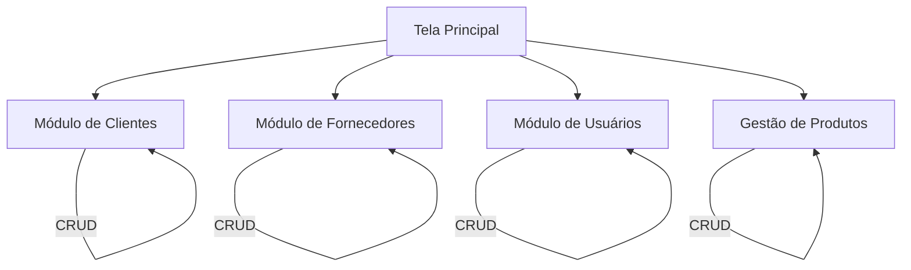

# 📦 Sistema Comércio POO - Trabalho P1

Este projeto é o **Trabalho de POO - P1**, desenvolvido para a disciplina de Programação Orientada a Objetos. O objetivo principal é a criação de um sistema comercial robusto que consolida o uso de classes, objetos e interfaces gráficas com Java.

---

## 🎯 Requisitos do Trabalho

Conforme as diretrizes da P1, o sistema contempla o processamento consistente de quatro entidades fundamentais, permitindo operações completas de:
- **🔍 Consulta**: Visualização de registros existentes.
- **➕ Inserção**: Adição de novos dados ao sistema.
- **📝 Alteração**: Edição de informações já cadastradas.

---

## 🚀 Entidades Gerenciadas

- **👤 Cadastro de Usuários**: Gestão de operadores do sistema.
- **👥 Cadastro de Clientes**: Controle de dados de contato e identificação de clientes.
- **⚙️ Gestão de Produtos**: Controle de itens, preços e estoque.
- **🏢 Gestão de Fornecedores**: Registro e vinculação de parceiros comerciais.

---

## 🛠️ Tecnologias e Componentes

O desenvolvimento é focado em Java Desktop Nativo, seguindo os requisitos acadêmicos:
- **GUI**: Utilização estrita de **Java AWT** e **SWING** para a construção das interfaces.
- **Lógica**: Implementação de encapsulamento e processamento de listas para persistência em memória.
- **Ambiente**: Desenvolvido como um projeto **NetBeans**, garantindo compatibilidade para a entrega.

---

## 📂 Estrutura de Navegação

---

## 💻 Como Executar

1. Importe o projeto no **Apache NetBeans**.
2. Certifique-se de que o JDK está configurado corretamente.
3. Execute a classe `Projeto.java` (pacote `projeto`) para iniciar a aplicação.

---
Desenvolvido como parte avaliativa da nota P1.
